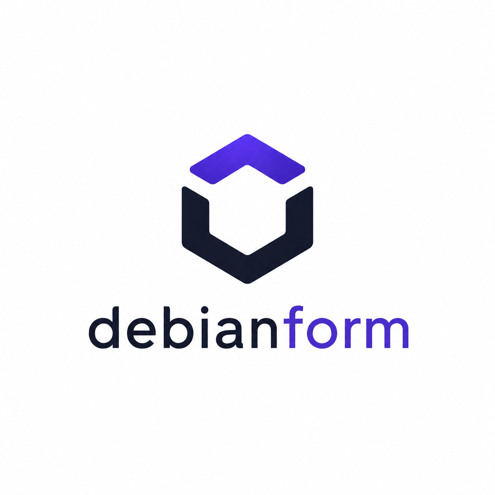

<p align="center">
  
</p>

# DebianForm

DebianForm 是面向 Debian 主机的 v2 配置工具，目前处于 public preview / beta 阶段。
CLI、v2 DSL、state 和发布产物在 stable 前仍可能出现破坏性变更；公开发布会在
`CHANGELOG.md` 和 release notes 中记录迁移影响。

当前仓库以 v2 为唯一主线：

- v2 用户语法记录在 `docs/`，设计夹具位于 `examples/v2-*.dbf.hcl`。
- `dbf validate` 可离线解析 profile/host 合并并校验 HostSpec。
- `dbf plan`、`dbf apply` 和 `dbf check` 已接入 v2 SSH 执行路径、runtime facts、
  v2 state 和 observed 检测；`dbf plan --offline` 保留纯本地预览。
- libvirt 集成测试位于 `test/integration/libvirt/`，用于在 Debian 13 VM 中验证 v2。

v2 用户层只写 `host`、`profile` 和领域块，不暴露旧式低阶资源语法。

## 支持优先级

- 最高优先级目标系统：Debian 13。
- 目标主机优先支持架构：amd64。

`dbf` CLI 安装在控制机或 CI runner 上，可以在 Linux 和 macOS 运行。公开发布产物覆盖
Linux/macOS 的 amd64 和 arm64；被管理目标主机当前仍以 Debian 13 为最高优先级。

## 安装和升级

推荐安装方式：

```bash
brew install mofelee/debianform/dbf
```

或：

```bash
curl -fsSL https://raw.githubusercontent.com/mofelee/debianform/main/scripts/install.sh | sh
```

安装后检查：

```bash
dbf version
```

升级：

```bash
brew update && brew upgrade dbf
```

curl 安装的用户重新运行安装脚本即可升级；需要回滚时使用安装脚本的 `--version` 参数安装
旧版本。

## 发布产物校验

每个 GitHub Release 包含四个平台 tarball、`checksums.txt`、cosign keyless bundle
`checksums.txt.sigstore.json`、SBOM 和 GitHub provenance attestation。

下载 release 后可校验 checksum：

```bash
sha256sum --check checksums.txt
```

校验 `checksums.txt` 的 cosign keyless 签名：

```bash
cosign verify-blob \
  --bundle checksums.txt.sigstore.json \
  --certificate-identity-regexp 'https://github.com/mofelee/debianform/.github/workflows/release.yml@refs/tags/v.*' \
  --certificate-oidc-issuer https://token.actions.githubusercontent.com \
  checksums.txt
```

校验 GitHub provenance attestation：

```bash
gh attestation verify dbf_<tag>_linux_amd64.tar.gz --repo mofelee/debianform
```

## 兼容性

旧实验配置格式已废弃，不再作为 CLI 入口或兼容目标。v2 文件必须使用 `host`、
`profile`、`component`、`locals` 等 v2 顶层块；旧式低阶 resource DSL 需要迁移为
v2 领域块或 component。

## v2 设计文档

- [v2 requirements](docs/v2-requirements.md)
- [v2 IR requirements](docs/v2-ir-requirements.zh.md)
- [v2 component input requirements](docs/v2-component-input-requirements.zh.md)
- [v2 variable and secrets](docs/v2-variable-secrets-requirements.zh.md)
- [v2 plan format](docs/v2-plan-format.md)
- [v2 state](docs/v2-state.md)
- [v2 systemd service units](docs/v2-systemd-service-units.md)
- [v2 implementation plan](docs/v2-implementation-plan.zh.md)
- [release process](docs/release-process.zh.md)
- [release automation plan](docs/release-automation-plan.zh.md)
- [release quick runbook](docs/release-quick-runbook.zh.md)

## v2 示例

`examples/` 中的文件是 v2 示例和设计夹具。当前已支持以下示例作为 v2 可运行样例；
依赖本地 source/secrets 的示例需要先准备对应文件，因为 validate 会读取这些输入。
默认 `plan` 会通过 SSH 探测 runtime facts 并读取远端状态；纯本地预览可使用
`plan --offline`：

- `examples/v2-bbr.dbf.hcl`
- `examples/v2-apt-source-file.dbf.hcl`
- `examples/v2-apt-repository.dbf.hcl`
- `examples/v2-bird2.dbf.hcl`
- `examples/v2-component-binary.dbf.hcl`（真实 apply 前需替换为上游下载物真实 sha256）
- `examples/v2-component-inputs.dbf.hcl`
- `examples/v2-files-plan-preview.dbf.hcl`
- `examples/v2-nftables.dbf.hcl`
- `examples/v2-plan-preview.dbf.hcl`
- `examples/v2-profile-merge.dbf.hcl`
- `examples/v2-shadowsocks-rust.dbf.hcl`
- `examples/v2-systemd-service.dbf.hcl`
- `examples/v2-systemd-service-unit.dbf.hcl`
- `examples/v2-user-group.dbf.hcl`
- `examples/v2-variable-secret-file.dbf.hcl`
- `examples/v2-wireguard-networkd.dbf.hcl`（真实 validate/apply 前需准备本地 `examples/secrets/wg-a.key` 和 `wg-b.key`）
- `examples/v2-systemd-networkd-wireguard.dbf.hcl`（同上，展示 systemd-networkd 原生写法）

其他示例仍为 design-only fixture，仅用于表达设计方向，不作为第一版可运行样例：

- `examples/v2-fleet.dbf.hcl`

design-only fixture 在进入可运行样例前，需要拆成小型 fixture，并加入 validate 与
golden 测试。

BBR v2 离线 plan 预览示例：

```bash
dbf plan -f examples/v2-bbr.dbf.hcl --offline
```

`-f file` 可以重复传入；传入一个或多个 `-f` 时只读取这些显式指定的文件，不传时读取当前目录所有
`*.dbf.hcl` 并按文件名排序。

```text
Plan:
  + host.bbr1.kernel.module["tcp_bbr"]
    create kernel module tcp_bbr
  + host.bbr1.kernel.sysctl["net.core.default_qdisc"]
    create sysctl net.core.default_qdisc
  + host.bbr1.kernel.sysctl["net.ipv4.tcp_congestion_control"]
    create sysctl net.ipv4.tcp_congestion_control

Summary: 3 create, 0 update, 0 delete, 0 no-op, 0 operations
```

结构化 plan 可用：

```bash
dbf plan -f examples/v2-bbr.dbf.hcl --format json --offline
```

开发调试时可显式显示低阶 provider address：

```bash
dbf plan -f examples/v2-bbr.dbf.hcl --format json --debug --offline
```

静态 HTML preview 可用：

```bash
dbf plan -f examples/v2-files-plan-preview.dbf.hcl --html plan.html --offline
```

领域型 component 可通过 validate 做本地语法和 HostSpec 检查：

```bash
dbf validate -f examples/v2-bird2.dbf.hcl
```

component 内可以读取 `target.system.codename` 等只读 host 视图，并展开为
`host.<host>.components.<instance>...` 地址。
这些 runtime facts 来自目标主机；需要完整 plan/apply 时，请使用可 SSH 连接的目标
主机，或用支持的本地离线样例。

component input 是 component 的公开 API，支持 `description`、`default`、
`nullable`、`sensitive`、`deprecated`、重复 `validation` block，以及
`list(object(...))`、`map(T)`、`tuple([...])`、`optional(...)` 等结构化类型。例如：

```hcl
input "listeners" {
  type = list(object({
    name = string
    port = number
    tls  = optional(bool, false)
  }))

  default  = []
  nullable = false

  validation {
    condition     = alltrue([for listener in input.listeners : listener.port >= 1 && listener.port <= 65535])
    error_message = "Each listener.port must be between 1 and 65535."
  }
}
```

调用方显式传入 `deprecated` input 时，`validate`、`plan`、`apply` 会输出 warning
但不改变退出码。`sensitive = true` 的 component input 会传播到由它派生的 file/unit
内容；HostSpec、plan 和 state 只保留摘要或 `"<sensitive>"`，不写入明文。
组件接口可用下面命令查看：

```bash
dbf component inspect -f examples/v2-component-inputs.dbf.hcl reverse_proxy
```

顶层 `variable` 用于 program 级外部输入。写入敏感文件时，推荐使用
`variable + files.file`：敏感值放在 `content`，非敏感 `content_version` 负责触发
write-only 更新。`secrets.file` 仍保留为兼容层，旧配置和 state address 不会因为新写法
立即失效，但会输出 deprecation warning。旧 `source = "secrets/app-token"` 可迁移为
`-var app_token=@secrets/app-token`。

```bash
dbf plan -f examples/v2-variable-secret-file.dbf.hcl --offline
```

component artifact 支持 `binary`、`file`、`archive` 和 `ca_certificate`。
它们可以声明 `source "<architecture>"` 并由运行时探测到的
`target.system.architecture` 选择唯一 source；无 label 的 `source {}` 表示架构无关，
不能和带 label 的 source 混用。
远程 URL source 必须声明 64 位 sha256，plan 会生成 download 和 install 节点；
`ca_certificate` 变化会额外触发 `update-ca-certificates` operation。

nftables 使用原生 ruleset/snippet 文件作为主路径，不提供通用 firewall 抽象。
多个 nftables 文件变化时，同一 host 只执行一次 validate 和 activate：

```hcl
host "edge1" {
  packages {
    install = ["nftables"]
  }

  nftables {
    enable = true

    main {
      content = <<-EOF
        flush ruleset
        include "/etc/nftables.d/*.nft"
      EOF
    }

    file "20-services" {
      content = "add rule inet filter input tcp dport { 22, 80, 443 } accept\n"
    }
  }
}
```

```bash
dbf plan -f examples/v2-nftables.dbf.hcl --offline
```

配置格式化会原地改写目标 HCL 文件：

```bash
dbf fmt -f examples/v2-bbr.dbf.hcl
```

远端执行和 drift 检查：

```bash
dbf apply -f examples/v2-bbr.dbf.hcl --auto-approve
dbf check -f examples/v2-bbr.dbf.hcl
```

上述命令需要示例中的 host 能通过 SSH 连接，并且远端为受支持的 Debian 系统。
`check` 在存在 create、update、delete、destroy 或 operation 时返回非零。

多 host 配置可以限制 host 级并发：

```bash
dbf apply --parallel 4 --auto-approve
```

每台 host 内部仍按 ResourceGraph 的确定性顺序串行执行。

systemd service unit 可以用纯文本写完整 unit，也可以用结构化 `service_unit`
生成常见 `.service`。两者都配合 `services.service` 管理 enabled/running 状态。
完整对比见 [v2 systemd service units](docs/v2-systemd-service-units.md)。

纯文本写法：

```hcl
host "service1" {
  files {
    file "/etc/myapp/config.yaml" {
      mode    = "0644"
      content = "listen: 127.0.0.1:8080\n"
    }
  }

  systemd {
    unit "myapp.service" {
      content = <<-EOF
        [Service]
        ExecStart=/usr/local/bin/myapp --config /etc/myapp/config.yaml
      EOF
    }
  }

  services {
    service "myapp" {
      enabled = true
      state   = "running"
    }
  }
}
```

结构化写法：

```hcl
host "service2" {
  files {
    file "/etc/myapp/config.yaml" {
      mode    = "0644"
      content = "listen: 127.0.0.1:8080\n"
    }
  }

  systemd {
    service_unit "myapp" {
      description = "My App"
      run         = ["/usr/local/bin/myapp", "--config", "/etc/myapp/config.yaml"]

      working_dir   = "/var/lib/myapp"
      restart       = "always"
      restart_delay = "5s"
      after         = ["network-online.target"]
      wants         = ["network-online.target"]
    }
  }

  services {
    service "myapp" {
      enabled = true
      state   = "running"
    }
  }
}
```

`files.file sensitive = true` 和兼容层 `secrets.file` 不会在 plan 中输出明文；plan 只输出
hash、长度等摘要。新配置优先使用 `variable + files.file` 表达敏感文件来源。
`services.service.state` 支持 `running`、`stopped`、`restarted` 和 `reloaded`。

## 常见错误

- `offline plan cannot resolve runtime facts`：离线 plan 遇到依赖
  `target.system.codename` 或 `target.system.architecture` 的 component。改用
  `dbf validate` 做本地检查，或对真实目标主机运行在线 plan。
- `must declare system.architecture` / `must declare system.codename`：component 需要
  runtime facts。真实主机会在线探测；纯本地 fixture 需要在 `host.system` 中显式声明。
- component input validation 失败：错误会指向
  `component.<name>.input["..."].validation[n]`，先修正调用方传入的 input 值。
- object 字段类型错误：错误路径会包含嵌套字段或列表下标，例如
  `inputs["listeners"][0].port`。
- component URL source 缺少 sha256：远程下载物必须声明 64 位 sha256。
- design-only fixture 无法 apply：先拆成第一版支持的小型示例，并补 validate/golden 测试。

## 集成测试

libvirt 集成测试会启动全新的 Debian 13 cloud VM，并执行 v2 `validate`、`apply` 和
`check`：

```bash
make test-integration-layout
make test-integration-case CASE=apt-source
make test-integration-case CASE=bbr
make test-integration-case CASE=files
make test-integration-case CASE=nftables
make test-integration-case CASE=shadowsocks-rust
make test-integration-case CASE=systemd-service-unit
make test-integration
```

## 开发

```bash
make build
make install DESTDIR=/tmp/debianform-install
make test
make update-golden
```

`make test` 运行 v2 Go 测试。
`make install` 会安装 `dbf`，并把 README、`docs/` 和 `examples/` 放入
`$(PREFIX)/share/debianform`。
`make update-golden` 使用 `UPDATE_GOLDEN=1` 刷新 snapshot/golden 测试输出。
