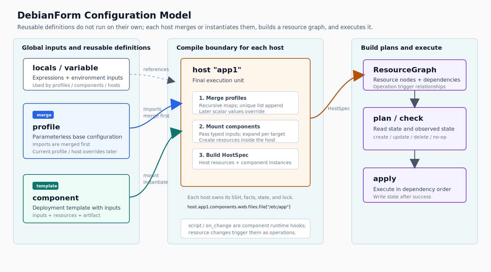

<p align="center">
  
</p>

<p align="center">
  <strong>English</strong> | <a href="./README.zh-CN.md">简体中文</a>
</p>

# DebianForm

DebianForm is a Debian-first declarative configuration tool that also supports selected Ubuntu targets.
Write a `.dbf.hcl` configuration, review the `plan`, run `apply`, and use `check` to detect drift.

> Managing Alpine Linux? See the sister project [AlpineForm](https://github.com/mofelee/alpineform).

It turns common server configuration into readable, auditable, and repeatable HCL:

- Manage files, directories, users, groups, APT, kernel/sysctl, systemd, nftables, Docker, and Compose.
- Generate a change plan before touching the target host.
- In online mode, read host facts, remote state, and observed state over SSH.
- Keep independent remote state and locks for each host to prevent concurrent applies.
- Redact secrets and sensitive content in plans, state, and HTML/JSON output.
- Keep `.dbf.hcl` direct enough for people to read and for LLMs to generate and modify.

The project is currently in public preview / beta. Debian 13 amd64 is the highest-priority target,
Debian 12 amd64 has Beta support, and Ubuntu 24.04 LTS amd64 is in Preview. Start with a low-risk test
host. The CLI, configuration format, state, and plan JSON may still change before the stable release.

<p align="center">
  
</p>

## Install in 30 Seconds

Homebrew is recommended on macOS and Linux:

```bash
brew install mofelee/debianform/dbf
dbf version
```

You can also use the installation script:

```bash
curl -fsSL https://raw.githubusercontent.com/mofelee/debianform/main/scripts/install.sh | sh
dbf version
```

## Quickstart in 5 Minutes

Prepare a low-risk Debian 13 amd64 host and give it a stable name in `~/.ssh/config` on the control
machine. DebianForm treats `host "server1"` as `ssh server1` by default, leaving connection details to
your SSH configuration.

Root access is required here. DebianForm needs to install packages, write to `/etc`, manage systemd,
and store state and locks under `/var/lib/debianform` and `/var/lock/debianform`. Sudo, become, and
non-root management connections are not currently supported.

```sshconfig
Host server1
  HostName 192.0.2.10
  User root
  IdentityFile ~/.ssh/id_ed25519
```

First, confirm that regular SSH access works:

```bash
ssh server1 'cat /etc/debian_version && uname -m'
```

Create and enter a configuration directory. For now, put only one `site.dbf.hcl` file in it:

```bash
mkdir debianform-demo
cd debianform-demo
```

Create `site.dbf.hcl`:

```hcl
variable "ss_password" {
  type      = string
  sensitive = true
}

component "shadowsocks_rust" {
  type    = "binary"
  version = "1.24.0"

  source "amd64" {
    url    = "https://github.com/shadowsocks/shadowsocks-rust/releases/download/v1.24.0/shadowsocks-v1.24.0.x86_64-unknown-linux-gnu.tar.xz"
    sha256 = "5f528efb4e51e732352f5c69538dcc76e8cf8f6d1a240dfb5b748a67f0b05f65"
  }

  extract {
    include = "ssserver"
  }

  install {
    path = "/usr/local/bin/ssserver"
  }

  directories {
    directory "/etc/shadowsocks-rust" {}
  }

  files {
    file "/etc/shadowsocks-rust/server.json" {
      mode = "0600"
      content = jsonencode({
        server      = "0.0.0.0"
        server_port = 8388
        password    = var.ss_password
        method      = "chacha20-ietf-poly1305"
        mode        = "tcp_and_udp"
      })
    }
  }

  systemd {
    service_unit "shadowsocks-rust" {
      description = "Shadowsocks Rust Server"
      run = [
        "/usr/local/bin/ssserver",
        "-c",
        "/etc/shadowsocks-rust/server.json",
      ]
      restart = "always"
      after   = ["network-online.target"]
      wants   = ["network-online.target"]
    }
  }

  services {
    service "shadowsocks-rust" {
      enabled = true
      state   = "running"
    }
  }
}

host "server1" {
  platform {
    architecture = "amd64"
    codename     = "trixie"
  }

  components = [
    component.shadowsocks_rust,
  ]
}
```

Pass the real password through the shell instead of writing it into the configuration, then run the
commands below. Because this directory contains only one `*.dbf.hcl` file, you do not need `-f`:

```bash
export DBF_VAR_ss_password="$(openssl rand -base64 32)"
dbf validate
dbf plan --offline
dbf plan
dbf apply
dbf plan
dbf check
```

This covers the complete workflow:

- `validate`: parse and validate the configuration locally without connecting to the host.
- `plan --offline`: preview resource addresses and the shape of changes locally.
- `plan`: read host facts, remote state, and observed state over SSH.
- `apply`: print an online preview, acquire the remote lock, recompute and show the actual plan, then
  execute the resource graph and write state after approval.
- The second `plan`: should be a no-op.
- `check`: detect remote drift and return a non-zero status when the host differs.

For a more complete Debian tutorial, see the [Quickstart](docs/quickstart.zh.md) (Chinese). For Ubuntu
24.04 LTS amd64, start with the [Ubuntu Preview Quickstart](docs/ubuntu-24.04-quickstart.zh.md)
(Chinese). Continue with the [User Manual](docs/user-manual/README.zh.md) (Chinese). See
[`examples/shadowsocks-rust.dbf.hcl`](examples/shadowsocks-rust.dbf.hcl) for the complete
multi-architecture, least-privilege version.

## Common Commands

```bash
# Validate configuration
dbf validate

# Preview locally without connecting to the target host
dbf plan --offline

# Plan online using facts, state, and observed state
dbf plan

# Produce a machine-readable plan
dbf plan --format json

# Produce a static HTML plan
dbf plan --html plan.html

# Apply changes
dbf apply

# Skip confirmation in CI or an ephemeral environment
dbf apply --auto-approve

# Check for drift
dbf check

# Format configuration
dbf fmt

# Inspect public component and variable inputs
dbf component inspect component_name
dbf variable inspect
```

Without `-f`, `dbf` reads all `*.dbf.hcl` files in the current working directory and sorts them by
filename. With one or more `-f path` arguments, each path may be a file or directory. Files are read in
command-line order. Each directory expands to its immediate `*.dbf.hcl` children in filename order;
subdirectories are not read recursively.

For example:

```bash
dbf validate -f ../shared -f .
dbf plan -f ../shared/base.dbf.hcl -f ./hosts/prod.dbf.hcl --offline
```

By default, `host "<name>"` connects through `ssh <name>` as root. Put connection details such as
`HostName`, `User`, `IdentityFile`, `ProxyJump`, and the port in `~/.ssh/config`. Add an `ssh` or `state`
block to `.dbf.hcl` only when you need to override the default connection name, port, identity file, or
state path.

## Configuration Model

At the user level, DebianForm configurations contain `host`, `profile`, `component`, `locals`,
`variable`, and domain blocks. You do not need to write low-level provider resources.

The top-level concepts have these boundaries:

<p align="center">
  
</p>

- A `host` is the final execution unit. `plan`, `apply`, and `check` all target hosts, and each host has
  its own SSH connection, remote state, and lock.
- A `profile` is a reusable base configuration fragment without parameters. A profile can be imported
  by another profile or host. Imported content is merged first, followed by the current profile or
  host, which overrides fields with the same name.
- A `component` is a parameterized, reusable deployment unit that wraps resources, exposes typed
  inputs, and may declare artifact downloads, builds, and installation. It expands only after being
  attached to a host; it does not have complete host semantics and cannot run independently.
- `script` / `on_change` define a component's internal runtime lifecycle. A component can declare
  reload, restart, or activation scripts to run after file changes; the host only attaches the
  component and supplies inputs.

A single `.dbf.hcl` file can combine reuse, host facts, packages, files, systemd, services, and
assertions in one declarative model. The following is a syntax overview; see
[`examples/fleet.dbf.hcl`](examples/fleet.dbf.hcl) for the complete runnable version.

```hcl
locals {
  admin_key = "ssh-ed25519 AAAA... admin@example"
}

variable "environment" {
  type     = string
  default  = "staging"
  nullable = false

  validation {
    condition     = contains(["dev", "staging", "prod"], var.environment)
    error_message = "environment must be dev, staging, or prod."
  }
}

profile "base" {
  system {
    timezone = "UTC"
    locale   = "en_US.UTF-8"
  }

  packages {
    install = ["ca-certificates", "curl", "vim"]
  }

  groups {
    group "deploy" {}
  }
}

component "app" {
  input "listen_addr" {
    type    = string
    default = "127.0.0.1:8080"
  }

  groups {
    group "app" {
      system = true
    }
  }

  users {
    user "app" {
      system = true
      group  = "app"
    }
  }

  systemd {
    service_unit "app" {
      description = "App worker"
      run         = ["/usr/local/bin/app", "--listen", input.listen_addr]
      user        = "app"
      group       = "app"
      restart     = "always"

      service_config = {
        NoNewPrivileges = true
        ProtectSystem   = "strict"
      }
    }
  }

  services {
    service "app" {
      enabled = true
      state   = "running"
    }
  }
}

host "app1" {
  imports = [profile.base]

  component "app" {
    source = component.app
    inputs = {
      listen_addr = "127.0.0.1:8080"
    }
  }

  system {
    hostname = "app1"
  }

  platform {
    codename = "trixie"
  }

  files {
    file "/etc/app/config.env" {
      owner   = "root"
      group   = "app"
      mode    = "0640"
      content = "APP_ENV=${var.environment}\n"
    }
  }

  systemd {
    resolved {
      enable = true

      resolve = {
        DNS = ["1.1.1.1", "9.9.9.9"]
      }
    }

    timer "app-healthcheck" {
      enable = true
      state  = "running"

      timer = {
        Unit       = "app.service"
        OnCalendar = "hourly"
        Persistent = true
      }
    }
  }

  assert {
    condition = self.platform.codename == "trixie"
    message   = "app1 example expects Debian 13 trixie."
  }
}
```

More runnable examples are available in `examples/`.
Common local preview commands:

```bash
dbf validate -f examples/bbr.dbf.hcl
dbf plan -f examples/bbr.dbf.hcl --offline
dbf validate -f examples/debian12-amd64.dbf.hcl
dbf plan -f examples/debian12-amd64.dbf.hcl --offline
dbf validate -f examples/ubuntu-24.04-preview.dbf.hcl
dbf plan -f examples/ubuntu-24.04-preview.dbf.hcl --offline
dbf validate -f examples/shadowsocks-rust.dbf.hcl
dbf validate -f examples/realistic-systemd-app.dbf.hcl
dbf plan -f examples/realistic-systemd-app.dbf.hcl --offline
dbf validate -f examples/fleet.dbf.hcl
dbf plan -f examples/fleet.dbf.hcl --offline
dbf plan -f examples/nftables.dbf.hcl --offline
```

The official Docker repository and cross-architecture components depend on target platform facts. Use
online `dbf plan` with a real host. A fully offline Ubuntu preview must declare
`platform.distribution`, `platform.version`, `platform.architecture`, and `platform.codename`.

Runnable examples covered by this README:

- `examples/bbr.dbf.hcl`
- `examples/apt-repository.dbf.hcl`
- `examples/bird2.dbf.hcl`
- `examples/component-binary.dbf.hcl`
- `examples/debian12-amd64.dbf.hcl`
- `examples/docker-minimal.dbf.hcl`
- `examples/docker-official-mirror.dbf.hcl`
- `examples/files-plan-preview.dbf.hcl`
- `examples/fleet.dbf.hcl`
- `examples/mihomo.dbf.hcl`
- `examples/nftables.dbf.hcl`
- `examples/plan-preview.dbf.hcl`
- `examples/profile-merge.dbf.hcl`
- `examples/realistic-systemd-app.dbf.hcl`
- `examples/shadowsocks-rust.dbf.hcl`
- `examples/systemd-service.dbf.hcl`
- `examples/ubuntu-24.04-preview.dbf.hcl`
- `examples/user-group.dbf.hcl`
- `examples/variable-secret-file.dbf.hcl`

See the [Support Matrix](docs/support-matrix.zh.md) (Chinese) for complete example status and coverage.

## Support Scope

- The CLI runs on Linux and macOS on amd64 and arm64.
- Debian 13 amd64 is currently the highest-priority managed target.
- Debian 12 amd64 is in Beta and joins Debian 13 amd64 in the blocking libvirt CI matrix. Debian 12
  arm64 remains in Preview.
- Ubuntu 24.04 LTS amd64 is in Preview with its own blocking 20-case matrix. Other Ubuntu releases,
  Ubuntu arm64, and desktop environments are unsupported.
- DebianForm does not manage Netplan or NetworkManager. Networkd configuration on Ubuntu requires an
  operator-prepared native-networkd target; ordinary non-network resources are unaffected.
- Debian 11 and earlier releases are unsupported.
- Online `plan`, `apply`, and `check` currently require root SSH key access to the target host.
- `ssh.user` must be omitted or set to `"root"`; sudo, become, and non-root management connections are
  not supported.
- Service processes may still run with reduced privileges through systemd `user` / `group`; this does
  not change the root requirement for the management connection.

For platform details, see the [Support Matrix](docs/support-matrix.zh.md) and
[Platform Support Strategy](docs/platform-support-strategy.zh.md) (Chinese). For security boundaries,
see the [Security Model](docs/security-model.zh.md) (Chinese).

## Documentation

The detailed documentation linked below is currently available in Chinese:

- [Quickstart](docs/quickstart.zh.md): from installation to the first `apply` / `check` on Debian.
- [Ubuntu Preview Quickstart](docs/ubuntu-24.04-quickstart.zh.md): a safe first run on Ubuntu 24.04 LTS
  amd64.
- [User Manual](docs/user-manual/README.zh.md): progressive, runnable tutorials.
- [CLI Manual](docs/cli.zh.md): every command, option, output format, and limitation.
- [Realistic Deployment Template](docs/realistic-deployment-example.zh.md): a least-privilege systemd
  application template.
- [Operations Runbook](docs/operations-runbook.zh.md): state locks, failure recovery, and drift
  diagnosis.
- [Support Matrix](docs/support-matrix.zh.md): supported systems, domain blocks, examples, and test
  coverage.
- [Compatibility Policy](docs/compatibility-policy.zh.md): compatibility and migration rules for beta
  and stable releases.
- [Plan JSON Format](docs/plan-format.md): structured output from `dbf plan --format json`.
- [State Format](docs/state.md): remote state, locks, ownership, and redaction rules.
- [Documentation Index](docs/README.zh.md): all user documentation, maintainer documentation, and
  archived design notes.

## Verify Release Artifacts

Each GitHub release contains platform tarballs, `checksums.txt`, a keyless cosign bundle, an SBOM, and
a GitHub provenance attestation. To quickly verify checksums:

```bash
sha256sum --check checksums.txt
```

See the [release process](docs/release-process.zh.md) (Chinese) for the complete release and
verification workflow.

## Development

```bash
make build
make test
```

The libvirt integration tests in `test/integration/libvirt/` verify the `validate`, `apply`, and
`check` workflow against fresh Debian VMs.
